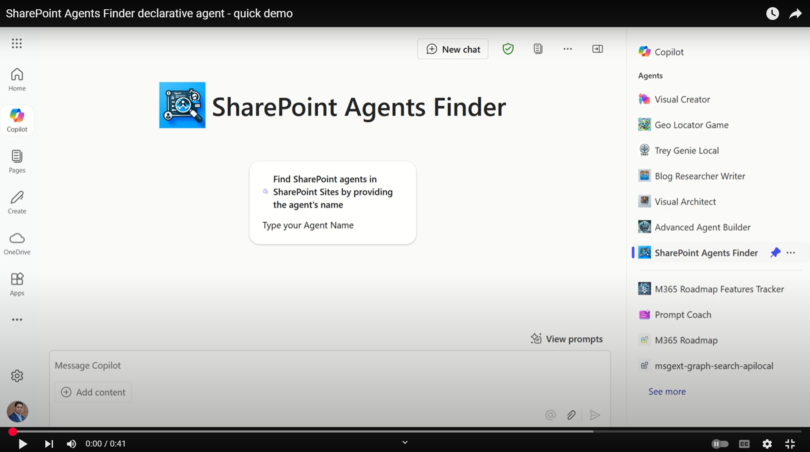

# SharePoint Agents Finder declarative agent

## Summary

SharePoint Agents Finder uses the Microsoft Graph API as a Copilot plugin in a declarative agent, leveraging the Microsoft Graph Search API /search/query endpoint to retrieve information about SharePoint Agents and event any file in Microsoft 365. It helps end users or IT Admins get info about SharePoint Agents in SharePoint or find files in Microsoft 365 using Graph API Search! 

## Overview

[](https://youtu.be/s6T6Uw5uC1Q)

## Contributors

* [Mohammad Amer](https://github.com/mohammadamer) - M365 Development MVP

## Version history

Version|Date|Comments
-------|----|--------
1.0|March 24, 2025|Initial solution
1.0|March 25, 2025|Updated README with Prerequisites and Minimal path to awesome

> **Prerequisites**

1. **Entra ID App Registration**:
   - Register an Entra ID application.
   - Assign the Graph API permissions: `Files.Read.All` as delegated permissions.
   - Retrieve the `ClientId`, `ClientSecret`, and `TenantID`.
   - Add the https://teams.microsoft.com/api/platform/v1.0/oAuthRedirect as a redirect URL for web platform in the Authentication settings.

2. **Teams developer portal**:
   - Open [Teams developer portal](https://dev.teams.microsoft.com/)
   - Add a new OAuth client registration 
   - Register a new client with the following information 
        - Registration name: da-sharepoint-agents-finder
        - Base URL: https://graph.microsoft.com/v1.0
        - Restrict usage by org: My organization only
        - Restrict usage by app: Any Teams app (when agent is deployed, use the Teams app ID).

   - OAuth settings
        - Client ID: <the entra ID application ID>
        - Client secret: <the Entra ID application secret>
        - Authorization endpoint `(replace tenantid by your own value)`: https://login.microsoftonline.com/tenantid/oauth2/v2.0/authorize
        - Token endpoint `(replace tenantid by your own value)`: https://login.microsoftonline.com/tenantid/oauth2/v2.0/token
        - Refresh endpoint `(replace tenantid by your own value)`: https://login.microsoftonline.com/tenantid/oauth2/v2.0/refresh
        - Scope: Files.Read.All
        - Save the information. 
        - A new OAuth registration key will be generated. Save it in secure place to be added in `.env.dev`

>
> To run this app template in your local dev machine, you will need:
>
> - [Node.js](https://nodejs.org/), supported versions: 18, 20
> - A [Microsoft 365 account for development](https://docs.microsoft.com/microsoftteams/platform/toolkit/accounts).
> - [Teams Toolkit Visual Studio Code Extension](https://aka.ms/teams-toolkit) version 5.0.0 and higher or [Teams Toolkit CLI](https://aka.ms/teamsfx-toolkit-cli)
> - [Microsoft 365 Copilot license](https://learn.microsoft.com/microsoft-365-copilot/extensibility/prerequisites#prerequisites)


1. First, select the Teams Toolkit icon on the left in the VS Code toolbar.
2. In the Account section, sign in with your [Microsoft 365 account](https://docs.microsoft.com/microsoftteams/platform/toolkit/accounts) if you haven't already.
3. Create Teams app by clicking `Provision` in "Lifecycle" section.
4. Select `Preview in Copilot (Edge)` or `Preview in Copilot (Chrome)` from the launch configuration dropdown.
5. Once the Copilot app is loaded in the browser, click on the "…" menu and select "Copilot chats". You will see your declarative agent on the right rail. Clicking on it will change the experience to showcase the logo and name of your declarative agent.
6. Ask a question to your declarative agent and it should respond based on the instructions provided.

## Tools and Frameworks


## What's included in the template

| Folder       | Contents                                                                                 |
| ------------ | ---------------------------------------------------------------------------------------- |
| `.vscode`    | VSCode files for debugging                                                               |
| `appPackage` | Templates for the Teams application manifest, the GPT manifest and the API specification |
| `env`        | Environment files                                                                        |

The following files can be customized and demonstrate an example implementation to get you started.

| File                               | Contents                                                                     |
| ---------------------------------- | ---------------------------------------------------------------------------- |
| `appPackage/declarativeAgent.json` | Define the behaviour and configurations of the declarative agent.            |
| `appPackage/manifest.json`         | Teams application manifest that defines metadata for your declarative agent. |

The following are Teams Toolkit specific project files. You can [visit a complete guide on Github](https://github.com/OfficeDev/TeamsFx/wiki/Teams-Toolkit-Visual-Studio-Code-v5-Guide#overview) to understand how Teams Toolkit works.

| File           | Contents                                                                                                                                  |
| -------------- | ----------------------------------------------------------------------------------------------------------------------------------------- |
| `teamsapp.yml` | This is the main Teams Toolkit project file. The project file defines two primary things: Properties and configuration Stage definitions. |

## Minimal path to awesome
1. **Clone the Repository**:
   - Clone this repository to your local machine.

2. **Navigate to Solution Folder**:
   - Ensure you are in the solution folder of the cloned repository.

3. **Update graphsearchplugin-openapi.yml**:
   - Ensure you open this file `appPackage\graphsearchplugin-openapi.yml` and update the `tenantid` with your tenant Id.
   ```
     securitySchemes:
    azureaadv2:
      type: oauth2
      flows:
        authorizationCode:
          authorizationUrl: https://login.microsoftonline.com/tenantid/oauth2/v2.0/authorize
          tokenUrl: https://login.microsoftonline.com/tenantid/oauth2/v2.0/token
   ```
3. **Update .env.dev file**:
   - Ensure you open this file and update this `OAUTH2_REGISTRATIONKEY` key with OAuth registration key generated in the prerequisites
   

## Key Features
- **Interactive Chat experience**: The SharePoint Agents Finder declarative agent offers a seamless and interactive chat experience within the Microsoft 365 Copilot chat interface.
- **Graph API Integration**: Utilizes the Microsoft Graph API as a Copilot plugin in a declarative agent.
- **Querying Microsoft 365 and SharePoint content**: Querying Microsoft 365 and SharePoint content  delivering structured responses in table format with links to files.


## Addition information and references

- [Declarative agents for Microsoft 365](https://learn.microsoft.com/en-us/microsoft-365-copilot/extensibility/overview-declarative-agent?wt.mc_id=MVP_433449)
- [Copilot developer Camp](https://aka.ms/copilotdevcamp?wt.mc_id=MVP_433449)
- [Microsoft 365 Copilot pro-developer samples](https://github.com/pnp/copilot-pro-dev-samples/)
